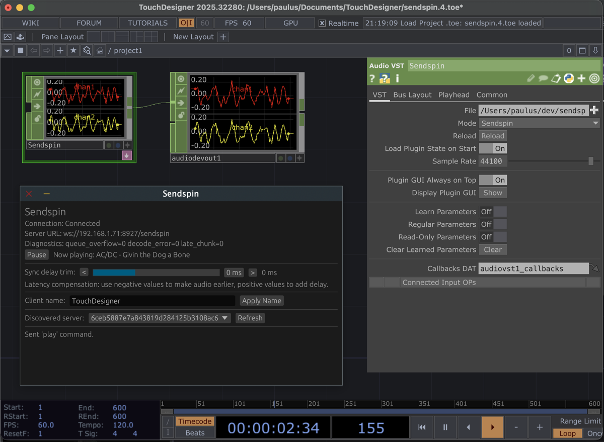

# sendspin-vst

Sendspin VST3 plugin implemented in Rust.

## Compatibility

- Requires Music Assistant 2.8.0b15 or newer.

## UI Preview



## Current scope

- VST3 instrument plugin with stereo output
- Custom plugin editor (`egui`) for server selection and status
- Background Sendspin WebSocket client
- Automatic discovery of Sendspin servers
- Timestamped playback scheduling on the audio thread using an SPSC ring buffer
- Underrun-driven sync state reporting (`synchronized`/`error`)
- Live diagnostics counters in the editor (`queue_overflow`, `decode_error`, `late_chunk`)

## Configuration

Server URL can be configured in the plugin GUI:

- Pick a discovered server from mDNS
- Choose `Other...` and enter a custom URL
- Click `Refresh` to re-query mDNS
- Set a custom client name and click `Apply Name`

A persistent `client_id` UUID is stored under your user config directory:

- macOS: `~/Library/Application Support/sendspin-vst3/client_id`
- Linux: `~/.config/sendspin-vst3/client_id`
- Windows: `%APPDATA%\\sendspin-vst3\\client_id`

## Build

```bash
cd sendspin-vst3
cargo check
cargo build --release
```

## Test

```bash
cd sendspin-vst3
cargo test
cargo clippy --all-targets --all-features -- -D warnings
```

For live server smoke tests (ignored by default):

```bash
# In another terminal: start a real server (example using sendspin-cli)
cd ../sendspin-cli
uv run sendspin serve --demo

# Back in sendspin-vst3
SENDSPIN_SMOKE_SERVER_URL=ws://127.0.0.1:8927/sendspin \
  cargo test network::tests::live_protocol_client_connects -- --ignored --nocapture
SENDSPIN_SMOKE_SERVER_URL=ws://127.0.0.1:8927/sendspin \
  cargo test network::tests::live_smoke_connects_to_sendspin_server -- --ignored --nocapture
```

To produce an actual `.vst3` bundle:

```bash
cd sendspin-vst3
cargo xtask bundle sendspin-vst3 --release
```

The bundle will be written to:

- `target/bundled/Sendspin VST3.vst3`
